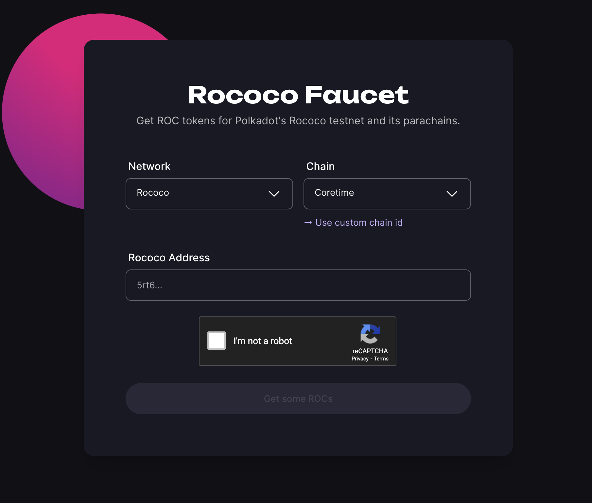

# Polkadot Networks

### Polkadot

Polkadot is architected with a multi-chain structure that scales and supports interoperability.&#x20;

In the center of the whole system is the **Relay chain**. Relay chain provides security, consensus, data availability and interoperability to all blockchains connected to it (parachains). Relay chain is also home to Polkadot's native token - DOT.&#x20;

**Parachains** are individual blockchains that run parallel to the Relay chain, and commit their blocks to it, therewith benefiting from Polkadot's security. Parachains do not need validators - their blocks are verified and validated by the Relay chain's validators. All a parachain team needs is to define their business logic and purchase coretime to access blockspace on the Relay chain. One can thing of an analogy with Ethereum rollups (pessimistic rollups to be accurate).

Each parachain has its own unique design, features, and use cases, but they all are part of one consensus system and share finality. The former enables true interoperability between parachains, without needing to rely on third parties, such as traditional bridges.&#x20;

Some parachains provide essential services and infrastructure to the whole network  - these are called **System chains.** Different system chains are in charge of governance logic ([Collectives](https://wiki.polkadot.network/docs/learn-system-chains#collectives)), identity management (to come in the future), or asset management ([Asset Hub](https://wiki.polkadot.network/docs/learn-system-chains#asset-hub)).

There is also a system parachain that handles Coretime!

**Coretime system chain** is responsible for the sale and manipulation of bulk coretime and eventually the purchase of on-demand coretime credits. It also handles scheduling the respective cores on the relay chain to the parachains. Lastic runs on Coretime chain.

### Kusama&#x20;

Kusama is Polkadot's canary network, and also its wild cousin. &#x20;

In other words, Kusama runs on the early, unaudited release of Polkadot software. It is not a testnet - after transitioning to NPoS, the network is fully controlled by the community or KSM holders, with KSM having economic value. Most parachain teams launch on Kusama to experiment and learn lessons before launching on Polkadot, and the same applies to system chains, in particular the Coretime chain.

Lastic marketplace is now live on Kusama, meaning you can purchase and run the Kusama Relay Chain coretime. Soon we will launch on Polkadot as well!

### Rococo

In the meantime you can test Lastic on **Rococo** - the testnet of both Polkadot and Kusama. Go to Rococo faucet and get some ROC!  Faucet :arrow\_down:



<figure><figcaption></figcaption></figure>

***

To switch bettween the Networks:

Give some information what Kusama, Polkadot and Rococo are.

<figure><figcaption></figcaption></figure>


Before you do any transactions check on which network you are by checking your url link


<figure><figcaption></figcaption></figure>

## Polkadot

Coretime will be coming soon to polkadot. The predictions are for it to be availiable by the end of Q2 2024.

## Kusama

Coretime was already deployed on Kusama.

## Test Networks:

### Rococo

Rococo is a test network, you can use it to test our application. Go to:

### Paseo

support for Paseo coming soon
