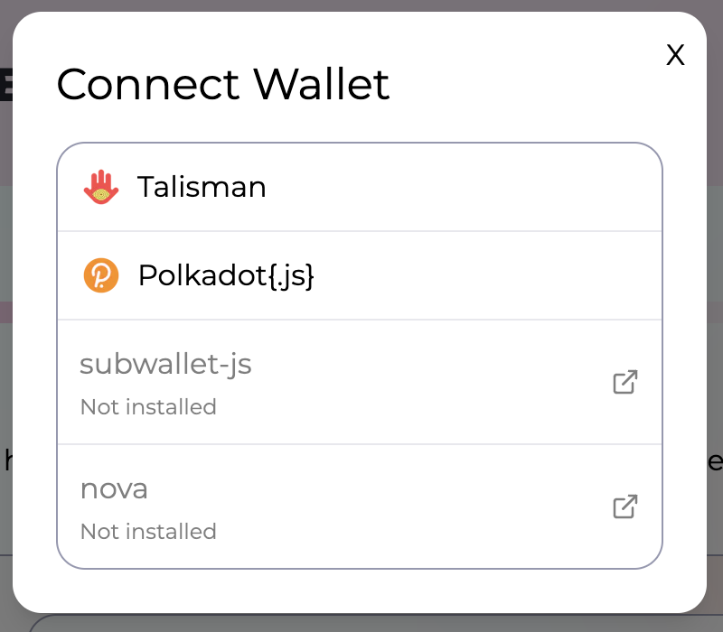

# Wallets

You won't be able to do much if you don't connect with your Polkadot wallet. Following is a list of most popular browser wallets that you can use:

* Polkadot js: [https://polkadot.js.org/extension/](https://polkadot.js.org/extension/)
* Talisman: [https://chromewebstore.google.com/detail/talisman-ethereum-and-pol/fijngjgcjhjmmpcmkeiomlglpeiijkld](https://chromewebstore.google.com/detail/talisman-ethereum-and-pol/fijngjgcjhjmmpcmkeiomlglpeiijkld)
* Subwallet: [https://chromewebstore.google.com/detail/subwallet-polkadot-wallet/onhogfjeacnfoofkfgppdlbmlmnplgbn](https://chromewebstore.google.com/detail/subwallet-polkadot-wallet/onhogfjeacnfoofkfgppdlbmlmnplgbn)

You could also choose to use the following mobile wallets:&#x20;

* Nova wallet: [https://novawallet.io/](https://novawallet.io/)
* Subwallet: [https://www.subwallet.app/](https://www.subwallet.app/)


Note: that up to now the website [https://www.lastic.xyz/](https://www.lastic.xyz/) is not yet browser compatible.


<figure><figcaption></figcaption></figure>

Choose the wallet you want to connect:

